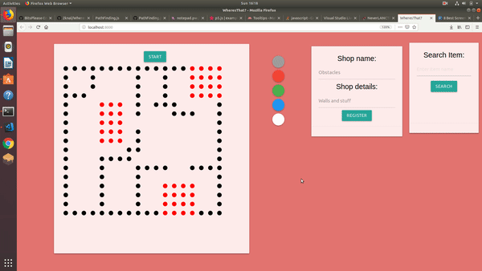

  

<h3 align="center">Where's that thing?</h3>

 

------------------------------------------

> This is a conceptual web model for implementing pathfinding algorithms and visualizing their real life use cases.

------------------------------------------
### Installation
`pip install django`
 
`cd <pathToRootDirectory>`
 
`python manage.py runserver`

### Features

- Seprate Admin and Client Side.

- Shortest path found using A* search algorithm.

- Custom Map feed option for admins.

- Users can enter their stops of interest, and the application comes up with an optimized path.

### Demonstration

 

------------------------------------------

### Add-Ons

- [ ] Actual map image feed
- [ ] Integration with Google Assistant

------------------------------------------

### Note

- This project was done under `30 hours with no pre-preparation`

------------------------------------------
### Contributors

- [@2knal](https://github.com/2knal)
- [@vtg2000](https://github.com/vtg2000)
- [@anay121](https://github.com/anay121)

> This repository is a part of DotSlash 2.0 Hackathon
